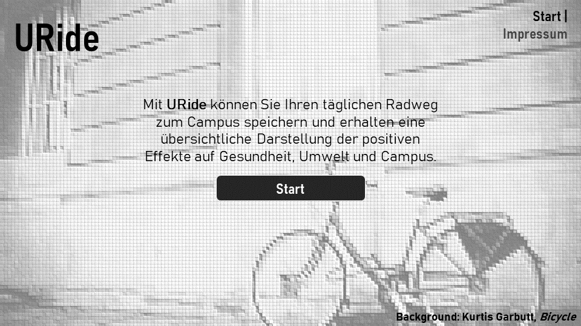
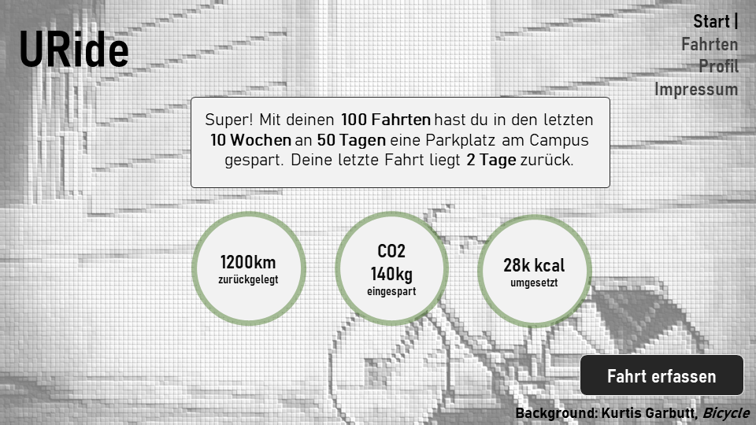

# URide

Mit der App *URide* können angehörige der Uni Regensburg ihren täglichen Radweg zum Campus speichern und erhalten eine übersichtliche Darstellung der positiven Effekte auf Gesundheit, Umwelt und Campus. 

## Team

| | Infos | Implementierte Komponenten
|-|-|-|
 | **Alexander Bazo** E-Mail: alexander.bazo@ur.de Github-Nutzer: alexanderbazo | Alexander Bazo hat die Komponente zur dauerhaften Speicherung der Fahrtaufzeichungen in der IndexedDB-Datenbank implementiert. |

## Setup

Die Anwendung ist vollständig als Client-seitige Lösung implementiert. Um die Anwendung zu testen, müssen zuerst notwendige Abhängigkeiten installiert werden. Anschließend kann die Applikation gebaut und über einen integrierten Webserver ausgeliefert werden. **Die Installation setzt eine vorhande *Node.js*-Umgebung in der Version `>= 10.16.0 LTS` voraus.** Die Anwendung wurde unter aktuellen Versionen von Windows 10 und MacOS getestet. 

1. Installieren Sie die notwendigen Abhängigkeiten mit dem Befehl `npm install`.

2. Erstellen Sie die Applikation mit dem Befehl `npm run build`.

3. Starten Sie die Anwendung mit dem Befehl `npm start`.

Nach dem Start kann die Anwendung über die URL `http://localhost:8000` lokal getestet werden. Die gebaute Anwendung befindet sich im Ordner `/build`.

## Beschreibung

URide ist eine Webanwendung für Angehörige der Universität Regensburg. Über ein einfaches Interface können die täglichen Fahrradfahrten an den Campus gespeichert werden. Nutzer können eine Liste aller gespeicherten Fahrten einsehen sowie einfache Statistiken und Informationen wie die insgesamt zurückgelegte Strecke, Tage ohne Fahrten oder die durchschnittlich benötige Zeit einsehen. Zusätzlich werden den Nutzern beispielhaft die positiven Effekte der Fahrradnutzung gegenüber anderen Verkehrsmitteln, insbesondere dem Auto angezeigt. 

### Features

- Start und *Onboarding*: Beim ersten Start können Nutzer ihren Namen sowie Ihre persönliche Adresse angeben. Für die Berechnung der körperlichen Auswirkungen des Fahrradfahrens werden Alter, Gewicht und Informationen zum Fahrrad eingegeben.

- Übersicht: Den Nutzern steht eine Übersichtsseite mit einer Sammlung der wichtigsten Informationen zur Verfügung. Angezeigt werden die gesamt zurückgelegte Strecke, die Informationen der letzten Fahrt, umgesetzte Kalorien, gegenüber der Verwendung eines PKWs eingespartes CO2 und die Anzahl der Tage, an denen kein Parkplatz am Campus benötigt wurde.

- Tracking: Benutzer können über ein einfaches Interface neue Fahrten zum Campus speichern. Dazu werden Start- und Ankunftszeit sowie mögliche Rückfahrten angegeben. Die Streckenberechnung berücksichtigt dabei immer die eingegebene persönliche Adresse sowie das geographische Zentrum des Campus. Alternativ können Nutzer hier andere Start- und Zielorte eingeben, die für zukünftige Fahrten gespeichert werden. Nach der Eingabe der Fahrt werden Strecke, Dauer und Effekte angezeigt.

- Fahrten: Der Nutzer kann eine Liste aller gespeicherten Fahrten einsehen und individuelle Fahrten editieren oder löschen.